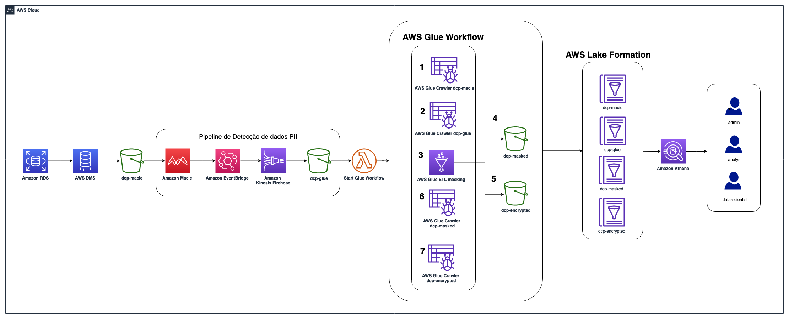

# Anonymizing Data Using Amazon Macie and AWS Glue

## Introduction

This project illustrates how it is possible to build an architecture that makes data anomization and allows granular access to them according to well-defined rules. 

This repository provides an [AWS CloudFormation](https://aws.amazon.com/cloudformation/) template that deploys a sample solution demonstrating how to leverage [Amazon Macie](https://aws.amazon.com/pt/macie/) to automatically detect PII data, and mask the respective PII data with [AWS Glue](https://docs.aws.amazon.com/glue/l) job and using Glue workflow with EventBridge e Kinesis Firehose to form an event-driven PII data processing pipeline and configure data access permission through [AWS Lake Formation](https://docs.aws.amazon.com/lake-formation/index.html)

For the scenario where a user cannot view the sensitive data itself, but can use it for training machine learning models, we will also use [AWS Secrets Manager](https://aws.amazon.com/secrets-manager). We will store the encryption keys that were used to mask the data and we will only give access to the training algorithms.

[Faker](https://faker.readthedocs.io/en/master/) is a Python package module utilized to generate fake name, address, phones, bank account number and credit card informations.

## AWS services used in this module
 1. [Amazon Athena](https://docs.aws.amazon.com/athena/latest/ug/what-is.html)
 2. [AWS CloudFormation](http://aws.amazon.com/cloudformation)
 3. [AWS DMS](http://aws.amazon.com/dms)
 4. [Amazon Elastic Compute Cloud (Amazon EC2)](http://aws.amazon.com/ec2)
 5. [AWS Glue](https://aws.amazon.com/glue)
 6. [AWS IAM](http://aws.amazon.com/iam)
 7. [AWS Key Management Service](https://docs.aws.amazon.com/kms/latest/developerguide/overview.html)
 8. [Amazon Kinesis Firehose](https://docs.aws.amazon.com/pt_br/firehose/latest/dev/what-is-this-service.html)
 9. [AWS Lake Formation](https://docs.aws.amazon.com/lake-formation/index.html)
 10. [AWS Lambda](https://docs.aws.amazon.com/lambda/latest/dg/welcome.html)
 11. [Amazon Macie](http://aws.amazon.com/macie)
 12. [Amazon RDS](http://aws.amazon.com/rds)
 13. [Amazon S3](http://aws.amazon.com/s3)
 14. [AWS Secrets Manager](https://aws.amazon.com/secrets-manager)
 15. [Amazon Virtual Private Cloud (Amazon VPC)](http://aws.amazon.com/vpc)

 ## Pre-requisites 
 1. Access to the above mentioned AWS services within AWS Account.
 2. Validate that there is a pre-existing AWS Lake Formation configuration. If so, there may be permission issues.
 3. Also see that for AWS DMS a permission is required for it to create the resources. If at some point you have already worked with DMS then this permission must already exist, otherwise Cloudformation will be able to create it. Select AWS IAM, then choose Roles, and see if there is a role named `dms-vpc-role`. If not, choose "yes" in Cloudformation, so that it creates this role in your account.

 ## Deployment
Please refer to this [blog post]() for the detailed instructions on how to use the solution.

## Solution Overview

1.	First we need to run AWS DMS task to extract data from the Amazon RDS instance. This makes the data available to Amazon Macie in an S3 bucket in Parquet format;

2.	We need to configure Amazon Macie to create a data classification job, so that it detects sensitive data. We have to define which bucket it should analyze and how it should present the generated reports; The job you create will run and evaluate the complete contents of your S3 bucket to determine if it has Personal Identifiable Information (PII) among the data. This work uses the managed identifiers available in Macie, in addition to adding your own custom identifiers.

3.  On the Custom data identifiers screen, you can select account_number. With the custom identifier, you can create custom business logic to look for certain patterns in files stored in S3. In this example, the task generates a finding for any file that contains data with the following format: Account Number Format: Starts with “XYZ-” followed by numbers. The logic for creating a custom data identifier can be found in the CloudFormation template.

4. Since Amazon Macie only identifies the information, we then need to create a workflow in AWS Glue that uses these Amazon Macie reports to run a script that will anonymize the data;  At the end of Macie's job, the results of the findings will be ingested into the *dcp-glue-<AWS_REGION>-<ACCOUNT_ID> bucket,* starting the workflow (*secureGlueWorkflow)* in Glue. We have to create a Python script that will parse this information and fetch the encryption keys from AWS Secrets Manager to anonymize the data found by Amazon Macie. Here, if necessary, you can make various customizations;

6. Encryption is being done using a technique called “Salt Hashing”, which consists of adding a key to the end of the original data before hashing is applied, adding entropy to the information that will be anonymized. The key that is being used in the technique will be retrieved from the Secret Manager from the parameters configured by the user before. The secret (a base64 encoded string, e.g. ‘TXlTZWNyZXQ=’) stored in AWS Secrets Manager to hash the PII columns;

7.	After the job is done, the new data file with PII data hashed will be written into the data output. Then, we must configure AWS Lake Formation to define and enforce fine-grained access permissions to provide secure access to data analysts and data scientists.

## Deployment on AWS

1.	Sign in to your AWS account
2.	Download the CloudFormation template file [here](https://gitlab.aws.dev/irisferr/mask-data-blog/-/raw/187abe2d082381c762b6e96e4a6b67057368713d/cloudformation.yml).
3.	Then upload the file in the [CloudFormation create stack page](https://console.aws.amazon.com/cloudformation/home#/stacks/create/template) to deploy the solution.
4.	Provide the CloudFormation stack a stack name or leave the value as default (“dcp”).
5.	Provide the CloudFormation stack a password on the TestUserPassword parameter for Lake Formation personas to log in to the AWS Management Console.
6.	Provide a secret (which will be base64 encoded during the CloudFormation stack creation) for the HashingSecretValue parameter used for data hashing.
7.	Check the box for acknowledgement at the last step of creating the CloudFormation stack
8.	Click “Create stack” 

## Cleaning Up

To avoid incurring future charges, delete the resources.

Navigate to the [CloudFormation console](https://console.aws.amazon.com/cloudformation/) and delete the stack named “dcp” (or the stack named with your customized value during the CloudFormation stack creation step).

## Security

See [CONTRIBUTING](CONTRIBUTING.md#security-issue-notifications) for more information.

## Reference links

[Building a serverless tokenization solution to mask sensitive data](https://aws.amazon.com/blogs/compute/building-a-serverless-tokenization-solution-to-mask-sensitive-data/) 

[Como anonimizar seus dados usando o AWS Glue](https://aws.amazon.com/pt/blogs/aws-brasil/como-anonimizar-seus-dados-usando-o-aws-glue/) 

[Create a secure data lake by masking, encrypting data, and enabling fine-grained access with AWS Lake Formation](https://aws.amazon.com/blogs/big-data/create-a-secure-data-lake-by-masking-encrypting-data-and-enabling-fine-grained-access-with-aws-lake-formation/) 

[Enabling data classification for Amazon RDS database with Macie](https://aws.amazon.com/blogs/security/enabling-data-classification-for-amazon-rds-database-with-amazon-macie/) 

## License

This library is licensed under the MIT-0 License. See the [LICENSE](LICENSE) file.
